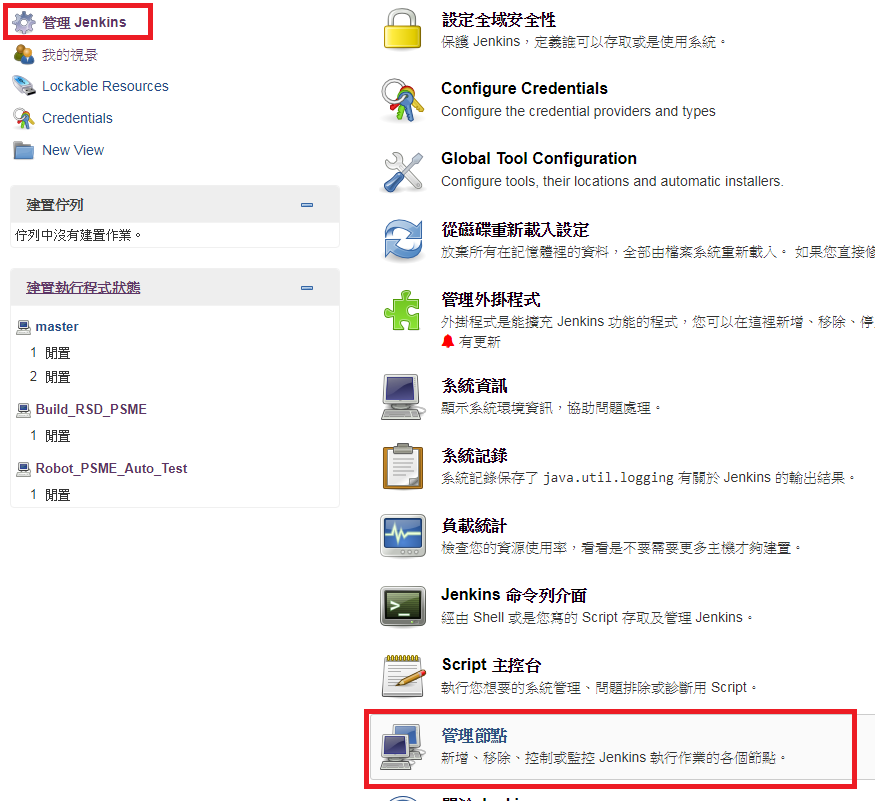
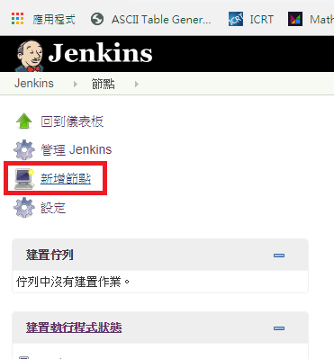
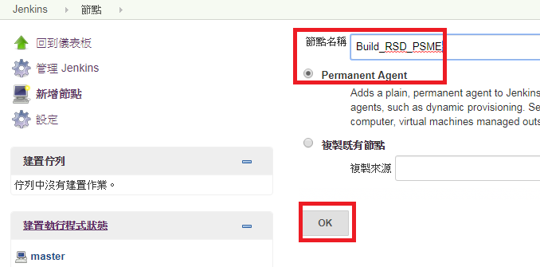
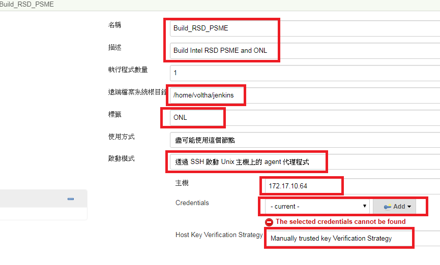
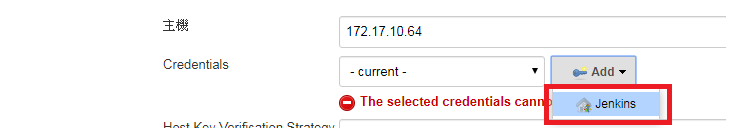
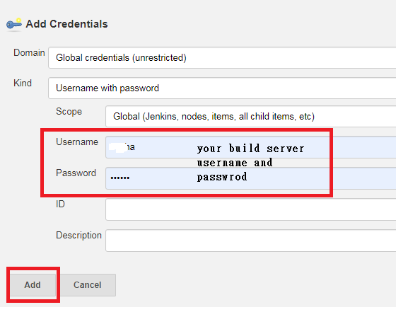
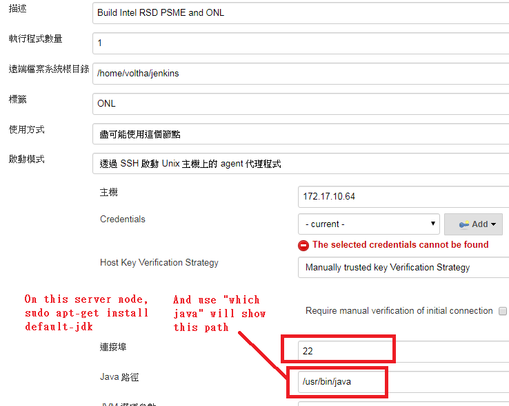
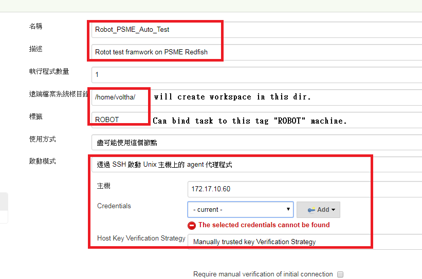
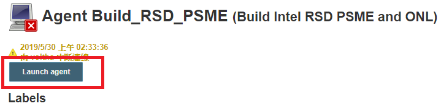
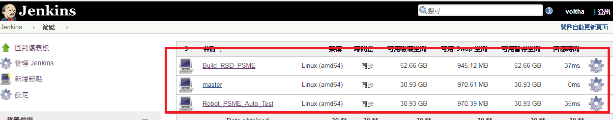

## Jenkins Installation Setup Guide ## 

* [Reference to](https://oranwind.org/-devops-jenkins-yu-centos-ubuntu-an-zhuang-jiao-xue/)

   1st Setup 


   ```
   sudo mkdir -p /data/jenkins
   ```

   ```
   sudo chown -R $USER:$GROUP /data
   ```

   ```
   docker run \
   --name jenkins \
   -d --restart always \
   -p 8080:8080 -p 50000:50000 \
   -v /data/jenkins:/var/jenkins_home \
   jenkins/jenkins:lts
   ```

   After container run up, enter container shell

   ```
   docker exec -i -t d672f161ae08 /bin/bash
   ```

   ```
   cat /data/jenkins/secrets/initialAdminPassword
   #cp above Password
   exit
   ```

   Open host browser

   ```
   http://localhost:8080
   ```

   Start config jenkins.


   Download plugins

   * [Robot framework](http://mirrors.jenkins-ci.org/plugins/robot/) 
   * [Publish Over SSH](https://updates.jenkins.io/download/plugins/publish-over-ssh/) 
   * [SSH plugin](https://updates.jenkins.io/download/plugins/ssh/) 

## Add Slave nodes ##

* Create 2 Slave Agents.  

   Add slave node 1 172.17.10.65 for building ecrf_pal and redfish or related SDK.

    
   
*  Add new node.

     
   
*  Add node name "Build_RSD_PSME" and this name can be bind by specific task later.

      
   
*  Because use "SSH" to start java agent, we need add SSH credentials username and password. 

      
   
*  Add credentials.

    
   
*  This 172.17.10.65 username and password.

      

*  Get into advanced items. 

       


*  Add Java path , if not install java, please use "sudo apt-get install default-jdk" to install. 

       
 
*  Add another build server slave note for robo framework to auto testing.

     
   
*  Add 2nd node. 

       

   
*  Add node name "Robot_PSME_Auto_Test" and this name can be bind by specific task later.

   And use the same procedures to set credentials and advanced items.

      

*  Launch both 2 agents. 

       

*  2 slaves node shouble in good status. 

       

[Continue add tasks](CI_TaskAdd.md)

