## Jenkins Installation Setup Guide ## 

## Add Build ONL RSD ##


*  Add system credentials used while need using ssh command to remote server.

   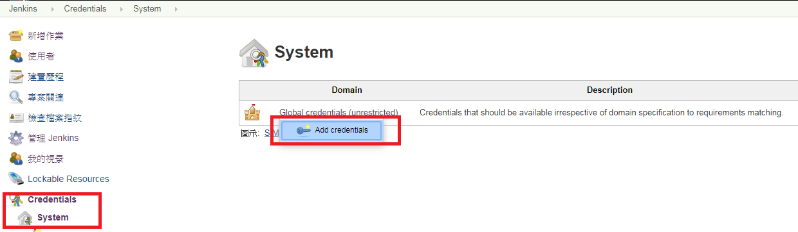 

*  User name and password for specific credentials. 

    
   
   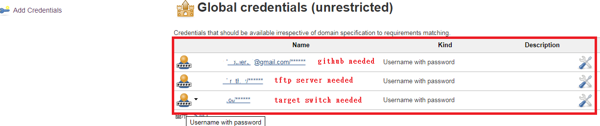 

*  Add remote SSH server 

   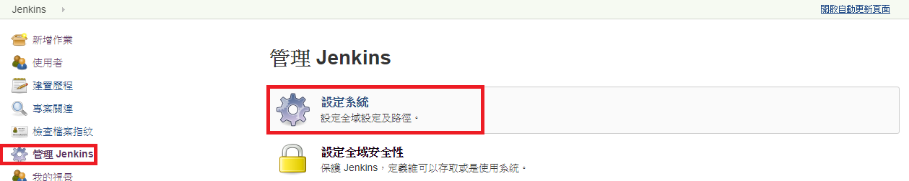 


   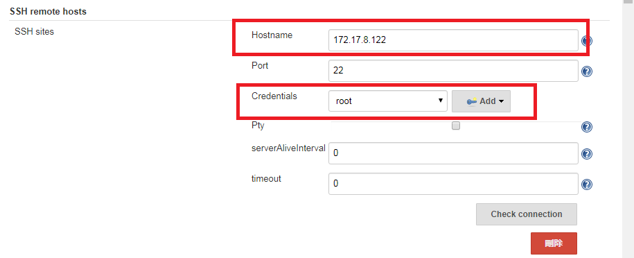 

 
   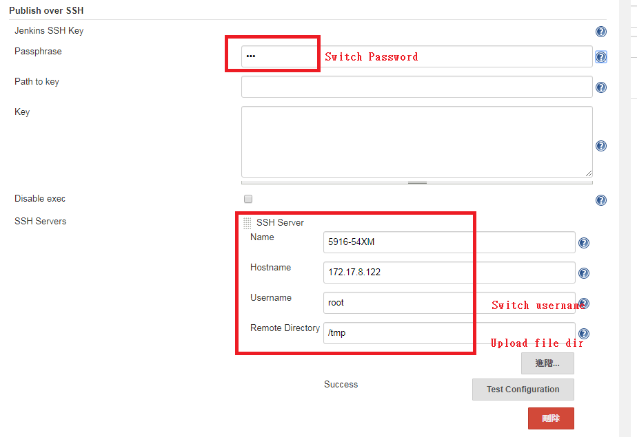 
   

*  Add "Build_ONL_RF" Task. 

   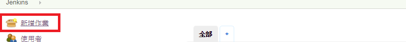 


   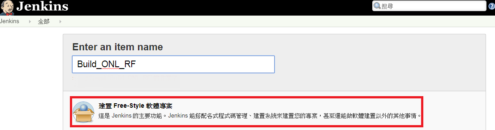 


*  Bind "Build_ONL_RF" Task to Slave node "Build_RSD_PSME".

   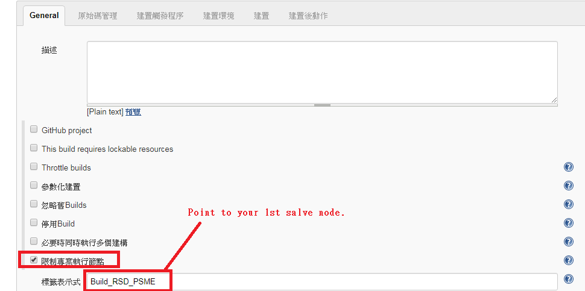 

*  Use following POST to triger this build task. 

   ```
   http://172.17.10.60:8080/job/Build_ONL_RF/build?token=05a8ab5 
   ```

   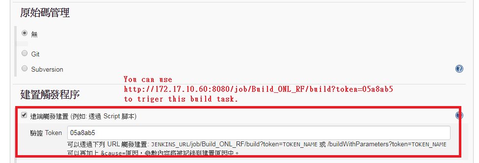 


*  Add shell command in this remote build server. 


   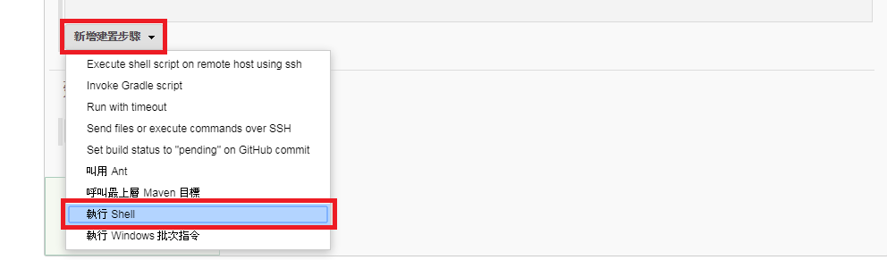 


   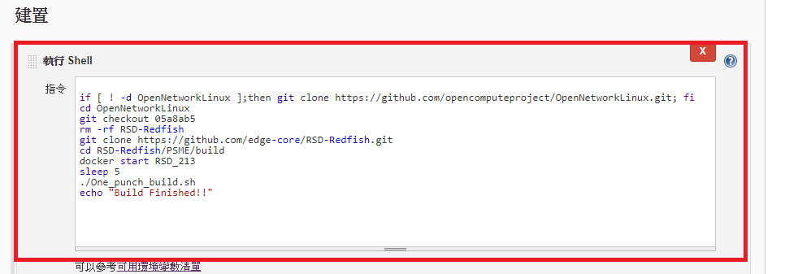 

   ```
   if [ ! -d OpenNetworkLinux ];then git clone https://github.com/opencomputeproject/OpenNetworkLinux.git; fi
   cd OpenNetworkLinux
   git checkout 05a8ab5
   rm -rf RSD-Redfish
   git clone https://github.com/edge-core/RSD-Redfish.git
   cd RSD-Redfish/PSME/build 
   docker start RSD_213
   sleep 5
   ./One_punch_build.sh
   echo "Build Finished!!"
   ```

*  Added target SSH server node. 

   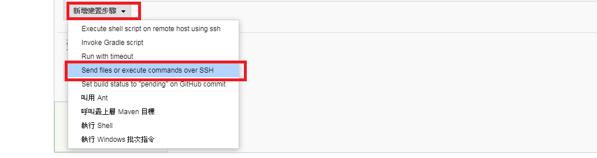 


    

## Add RF Auto Test Task ##


*  Added new task. 

    


   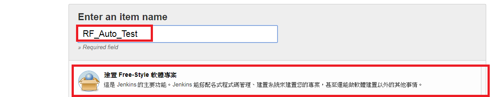 

*  Added new git url and specific slave node "Robot_PSME_Auto_Test" to run this task. 

    


*  Add git url and its credential.

   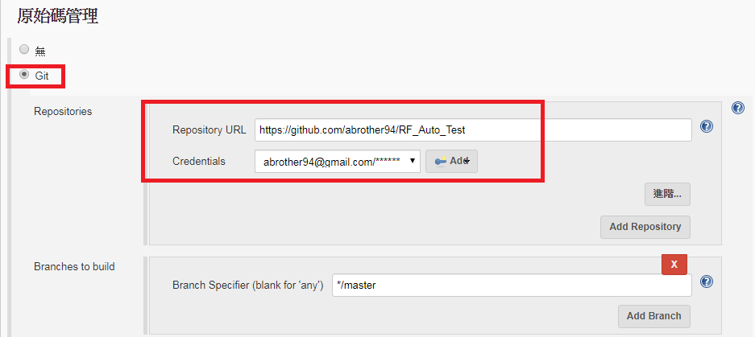 


*  This test will be triggered successful built "Build_ONL_RF" Task 

   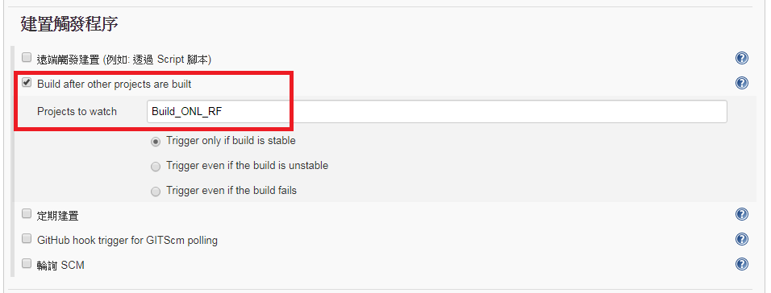 


*  Add robot auto test shell command. 

   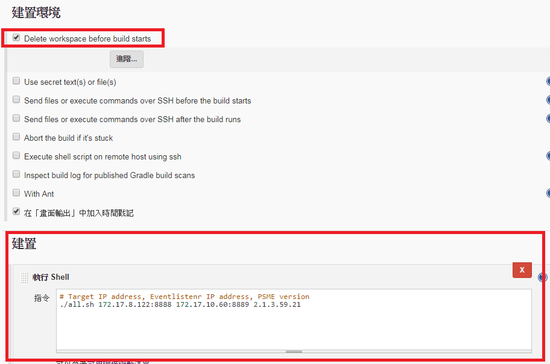 
   
   you can change "172.17.10.122" to your target IP address if have new
   
   one want to test.
```
# Target IP address, Eventlistenr IP address, PSME version
#./all.sh 172.17.8.122:8888 172.17.10.60:8889 2.1.3.59.21
./all.sh 172.17.10.7:8888 172.17.10.60:8889 2.1.3.59.21

```

*  After test need have report to recored.

   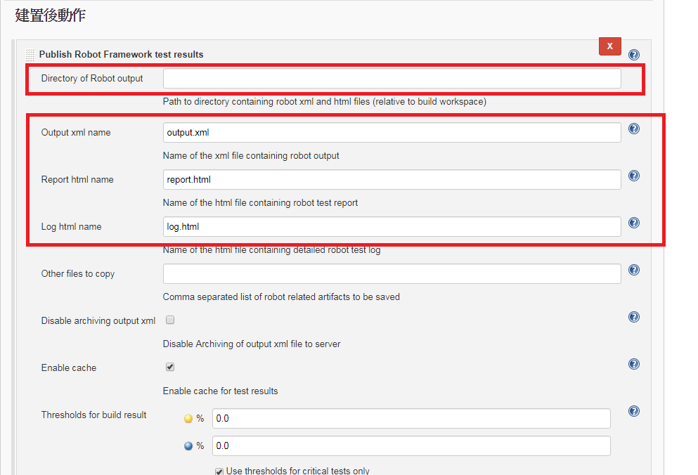 


*  Start build and test.

   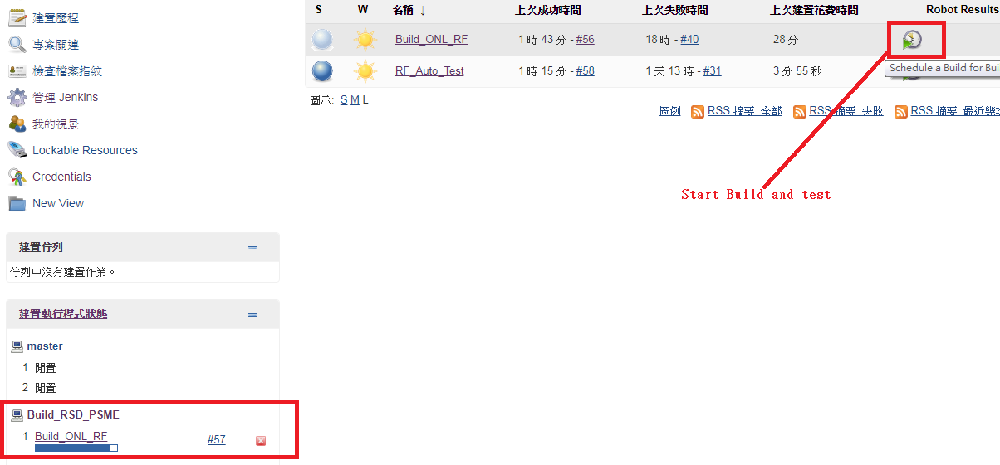 

* Prepre robot test result report

   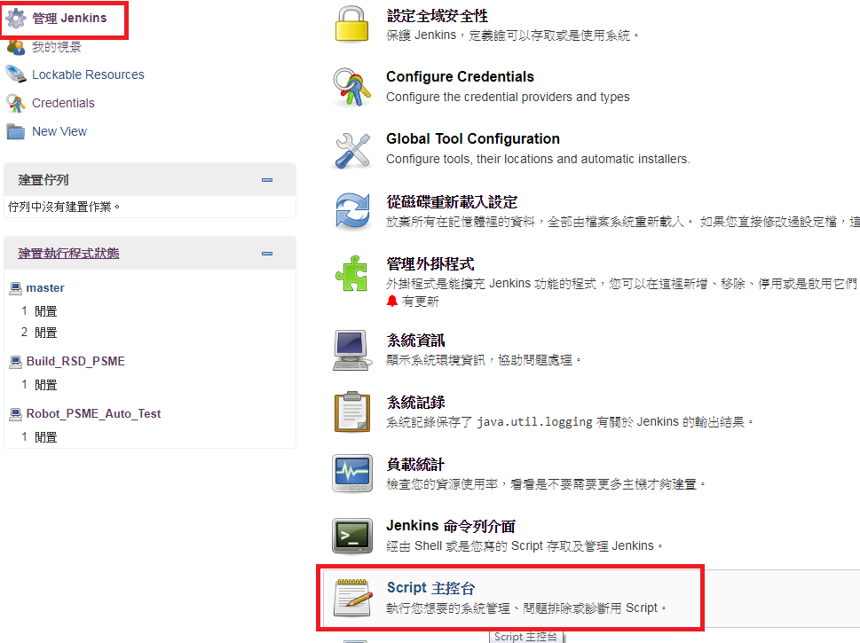 

* Add following to text box and save.

   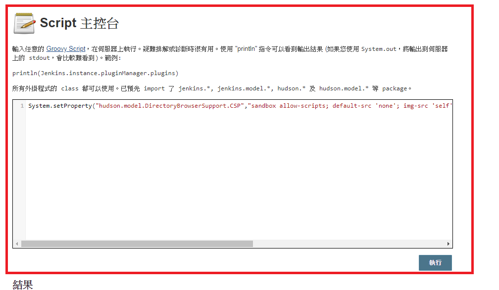 

```
System.setProperty("hudson.model.DirectoryBrowserSupport.CSP","sandbox allow-scripts; default-src 'none'; img-src 'self' data: ; style-src 'self' 'unsafe-inline' data: ; script-src 'self' 'unsafe-inline' 'unsafe-eval' ;")
```

* Check robot test report.

   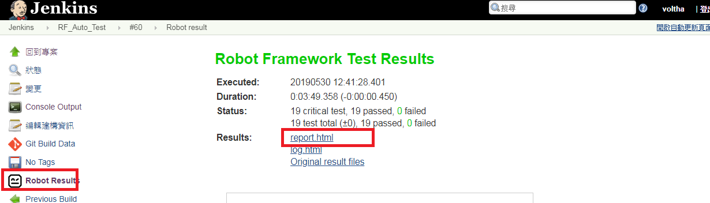 

   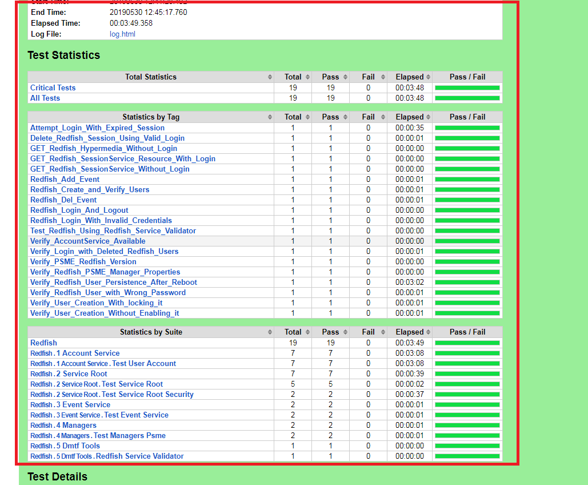 


## Export current docker image and import ##


*  Export images

```
$ docker ps -a

CONTAINER ID        IMAGE                   COMMAND               CREATED       STATUS           PORTS                                              NAMES

d672f161ae08        jenkins/jenkins:lts     "/sbin/tini -- /us..."  5 days ago   Up 23 hours     0.0.0.0:8080->8080/tcp, 0.0.0.0:50000->50000/tcp   jenkins

$ docker export --output="jenkins_2019_5_29.tar" jenkins

$ cd /data/ ; tar zcvf jenkins_data.tar.gz jenkins

``` 

*  Export images
   
   Copy 

   jenkins_2019_5_29.tar; jenkins_data.tar.gz to new server ./

```
$ cd ~/

$ cat jenkins_2019_5_29.tar.gz	 | docker import - jenkins

# Then it will create new docker image "jenkins" localy.

$ cd /date ; cp ~/jenkins_data.tar.gz ./

$ chown 1000:1000 /data/jenkins
```

Create docker file

```
$ mkdir DockerFile; cd DockerFile;

$ vim Dockerfile

///////////////////////////////////////////////////////////////////////
FROM jenkins
MAINTAINER nick_huang

ENV COPY_REFERENCE_FILE_LOG="/var/jenkins_home/copy_reference_file.log"
ENV HOME="/var/jenkins_home"
ENV HOSTNAME="d672f161ae08"
ENV JAVA_DEBIAN_VERSION="8u212-b01-1~deb9u1"
ENV JAVA_HOME="/docker-java-home"
ENV JAVA_VERSION="8u212"
ENV JENKINS_HOME="/var/jenkins_home"
ENV JENKINS_INCREMENTALS_REPO_MIRROR="https://repo.jenkins-ci.org/incrementals"
ENV JENKINS_SLAVE_AGENT_PORT="50000"
ENV JENKINS_UC="https://updates.jenkins.io"
ENV JENKINS_UC_EXPERIMENTAL="https://updates.jenkins.io/experimental"
ENV JENKINS_VERSION="2.164.3" 

EXPOSE 8080
EXPOSE 50000

///////////////////////////////////////////////////////////////////////

```

Save and exit

Then excute below to create new images

```
$ docker build -t myjenkins . --no-cache
```

Start container from "myjenkins" docker image and run in background :

```
$   docker run --user 1000:1000 -d  -p 8080:8080 -p 50000:50000 -v /data/jenkins_home:/var/jenkins_home myjenkins /sbin/tini -- /usr/local/bin/jenkins.sh 
```

Enter container

```
$   docker exec -it d672f161ae08 /bin/bash
```

Then you can login into jenkins webpage and reconfig credentials again.

   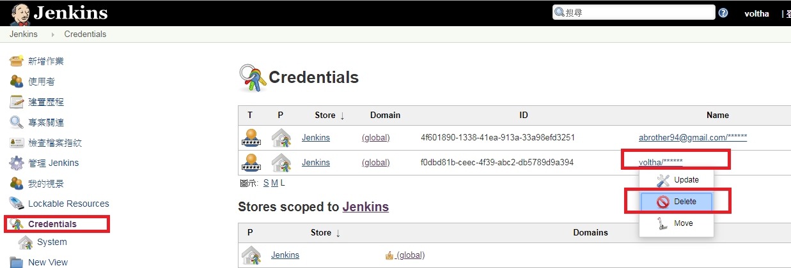 

    

   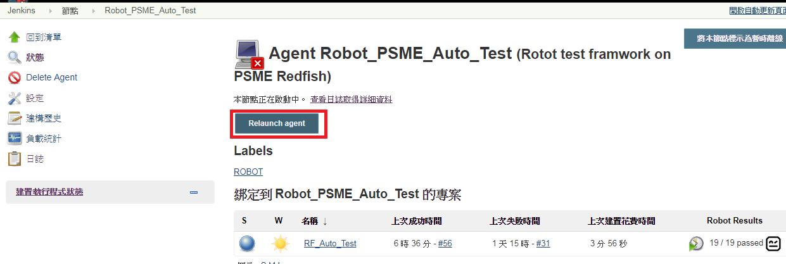 

* Add following to text box and save.

```
System.setProperty("hudson.model.DirectoryBrowserSupport.CSP","sandbox allow-scripts; default-src 'none'; img-src 'self' data: ; style-src 'self' 'unsafe-inline' data: ; script-src 'self' 'unsafe-inline' 'unsafe-eval' ;")
```

    


